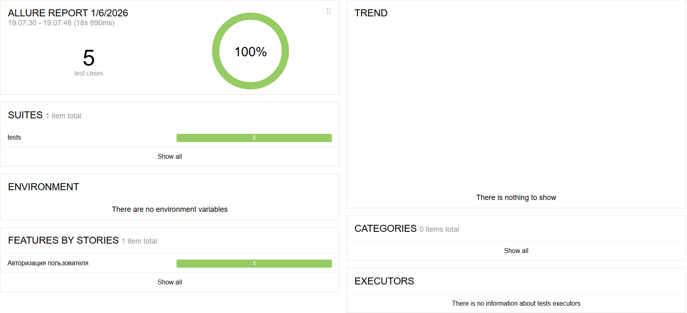
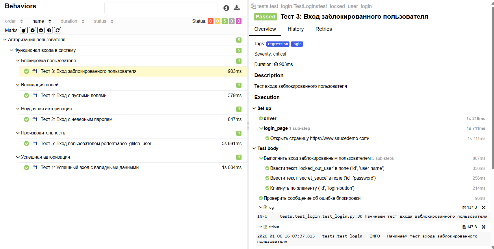
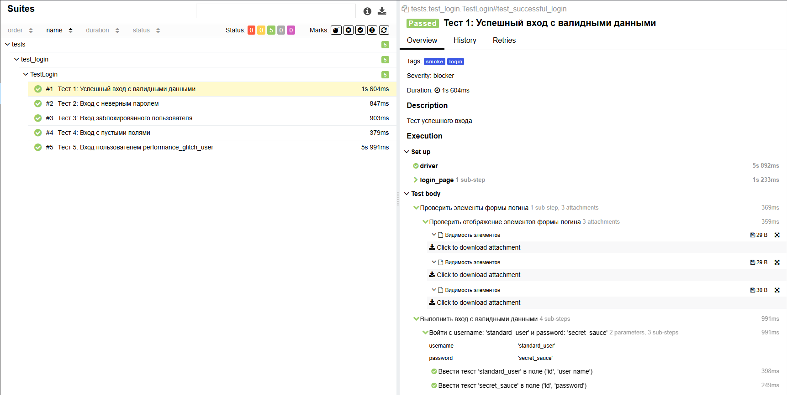
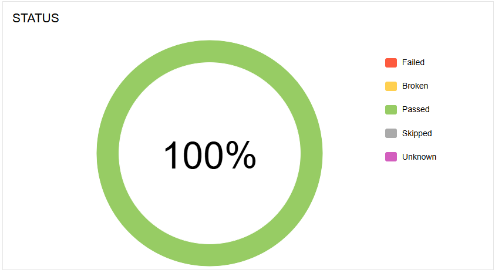
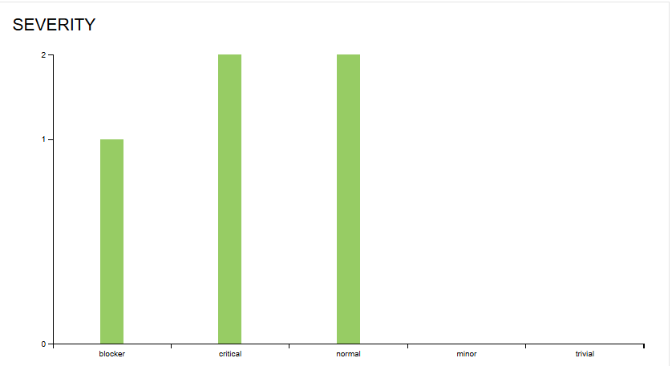
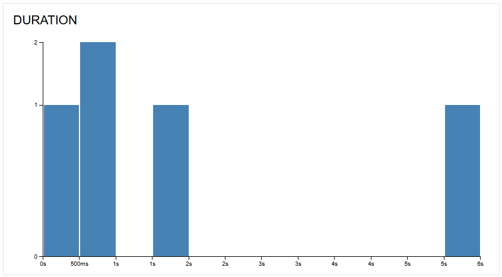
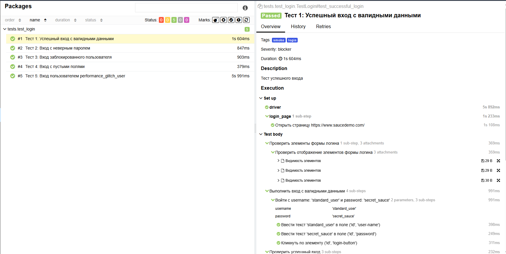

# SauceDemo Automation Project


**Все тесты проходят** | **Детальная отчетность** | **Docker поддержка** | **Code quality tools**

Проект автоматизации тестирования авторизации на сайте [SauceDemo](https://www.saucedemo.com/).

## Технологии
- **Python 3.10**
- **Selenium WebDriver** 4.13.0
- **Pytest** 7.4.3
- **Allure Framework** 2.13.2
- **Docker**
- **Pre-commit hooks** (Black, isort, flake8)

## Структура проекта
```
SauceDemo/
│   .gitignore
│   .pre-commit-config.yaml  # Конфигурация pre-commit hooks
│   clean.bat                # Скрипт очистки для Windows
│   clean.sh                 # Скрипт очистки для Linux/Mac
│   conftest.py              # Pytest фикстуры и настройки
│   Dockerfile               # Docker конфигурация
│   pytest.ini               # Конфигурация Pytest
│   README.md
│   requirements.txt         # Зависимости Python
│   run_tests.bat            # Скрипт запуска тестов для Windows
│   run_tests.sh             # Скрипт запуска тестов для Linux/Mac
│   LICENSE
│   docs/
│   ├── allure-dashboard.png         (главный дашборд)
│   ├── allure-tests-list.png        (список тестов)
│   ├── allure-test-details.png      ( детали теста)
│   ├── allure-status-chart.png      (график статусов)
│   ├── allure-severity-chart.png    (график критичности)
│   ├── allure-duration-chart.png    (график длительности)
│   └── allure-packages-view.png     (вид по пакетам)
├───pages/                   # Page Object паттерн
│   │   base_page.py         # Базовый класс страницы
│   │   login_page.py        # Страница авторизации
│   │   inventory_page.py    # Страница инвентаря
│   │   __init__.py
│
├───tests/                   # Тестовые сценарии
│   │   test_login.py        # 5 тестов авторизации
│   │   __init__.py
│
├───utils/                   # Утилиты и конфигурация
│   │   config.py            # Настройки приложения
│   │   logger.py            # Конфигурация логирования
│   │   __init__.py
│
├───allure-results/          # Результаты Allure (генерируется)
├───allure-report/           # HTML отчеты Allure (генерируется)
└───.pytest_cache/           # Кэш Pytest (генерируется)
```

## Демонстрация отчетов Allure

### 1. Главный дашборд


### 2. Список тестов


### 3. Детали теста с шагами выполнения


### 4. Графики аналитики

#### Статусы тестов


#### Критичность тестов


#### Длительность выполнения


#### Группировка по пакетам


### Ключевые метрики:
- **Всего тестов:** 5
- **Успешно:** 5 (100%)
- **Время выполнения:** ~24 секунды
- **Среднее время теста:** ~10 секунд
- **Стабильность:** 100% (без флаки-тестов)

## Быстрый старт

### 1. Локальная установка и запуск

```bash

# Клонировать репозиторий (если нужно)
# git clone https://github.com/svirilinmax/SauceDemo.git
# cd SauceDemo

# Создать виртуальное окружение
python -m venv venv

# Активировать окружение
# Windows:
venv\Scripts\activate
# Linux/Mac:
source venv/bin/activate

# Установить зависимости
pip install -r requirements.txt

# Установить pre-commit hooks (опционально)
pre-commit install
```

### 2. Настройка pre-commit (опционально)

```bash

# Запустить проверки перед коммитом
pre-commit run --all-files

# Автоматически запускать при каждом коммите
pre-commit install
```

### 3. Запуск тестов

#### Использование скриптов запуска:

**Windows:**
```cmd
# Очистка проекта перед запуском
clean.bat

# Запуск всех тестов с автоматическим открытием Allure отчета
run_tests.bat
```

**Linux/Mac:**
```bash

# Очистка проекта перед запуском
chmod +x clean.sh run_tests.sh
./clean.sh

# Запуск всех тестов с автоматическим открытием Allure отчета
./run_tests.sh
```

#### Ручной запуск через командную строку:

```bash

# Запуск всех тестов
pytest tests/ -v

# Запуск с генерацией Allure отчетов
pytest tests/ --alluredir=allure-results -v

# Генерация и открытие Allure отчета

### Вариант 1: Постоянный отчет (сохраняется на диск)
allure generate allure-results -o allure-report --clean

# Откроет в браузере
allure open allure-report

### Вариант 2: Временный отчет (автоматический запуск сервера)
# Автоматически откроет в браузере на случайном порту
allure serve allure-results
# После запуска появится ссылка типа: http://127.0.0.1:59480
```

**Примечание:** При использовании `allure serve` отчет откроется автоматически в браузере на случайном порту. Если браузер не открылся, проверьте консоль - там будет ссылка вида `http://127.0.0.1:59480`.

### 4. Параллельный запуск тестов

```bash

# Запустить тесты в 2 потока
pytest tests/ -n 2 -v

# Автоматически определить количество ядер
pytest tests/ -n auto -v
```

### 5. Запуск конкретных тестов

```bash

# Запуск одного теста
pytest tests/test_login.py::TestLogin::test_successful_login -v

# Запуск тестов по маркеру
pytest tests/ -m "smoke" -v
pytest tests/ -m "regression" -v
```

## Запуск в Docker

### Сборка и запуск

Проект включает Dockerfile для запуска тестов в изолированной среде. Для успешного запуска тестов в Docker необходимо:

1. **Собрать Docker образ:**
```bash

docker build --no-cache -t saucedemo-automation .
```

2. **Запустить тесты в контейнере:**

**Базовый запуск (только выполнение тестов):**
```bash

docker run --rm saucedemo-automation
```

**Запуск с сохранением результатов Allure на хосте:**
```bash

docker run --rm -v "$(pwd)/allure-results:/app/allure-results" saucedemo-automation
```

**Запуск и просмотр отчета:**
```bash

# 1. Собрать образ (если еще не собран)
docker build --no-cache -t saucedemo-automation .

# 2. Запустить тесты и сохранить результаты
docker run --rm -v "$(pwd)/allure-results:/app/allure-results" saucedemo-automation

# 3. Просмотреть отчет Allure
allure serve allure-results
```

**Полный пример для Windows PowerShell:**
```powershell
# Очистить старые результаты (опционально)
.\clean.bat

# Собрать Docker образ
docker build --no-cache -t saucedemo-automation .

# Запустить тесты в контейнере
docker run --rm -v "${PWD}/allure-results:/app/allure-results" saucedemo-automation

# Открыть отчет Allure
allure serve allure-results
```

**Полный пример для Linux/Mac:**
```bash

# Сделать скрипты исполняемыми
chmod +x clean.sh run_tests.sh

# Очистить старые результаты (опционально)
./clean.sh

# Собрать Docker образ
docker build --no-cache -t saucedemo-automation .

# Запустить тесты в контейнере
docker run --rm -v "$(pwd)/allure-results:/app/allure-results" saucedemo-automation

# Открыть отчет Allure
allure serve allure-results
```

### Docker с локальными файлами

```bash

# Запуск с монтированием текущей директории
docker run --rm -v "$(pwd):/app" -w /app python:3.10-slim \
  sh -c "apt-get update && apt-get install -y wget gnupg && \
  pip install -r requirements.txt && \
  pytest tests/ --alluredir=allure-results -v"
```

## Генерация отчетов Allure

### Установка Allure

```bash

# Windows: скачать с https://github.com/allure-framework/allure2/releases
# Добавить в PATH

# MacOS:
brew install allure

# Linux (Ubuntu/Debian):
sudo apt-add-repository ppa:qameta/allure
sudo apt-get update
sudo apt-get install allure
```

### Генерация отчетов

```bash

# Генерация HTML отчета
allure generate allure-results -o allure-report --clean

# Открытие отчета в браузере
allure open allure-report

# Или используйте serve для временного отчета
allure serve allure-results
```

## Поддержка code quality

Проект использует pre-commit hooks для поддержания качества кода:

- **Black** - автоматическое форматирование кода
- **isort** - сортировка импортов
- **flake8** - проверка стиля кода
- **trailing-whitespace** - удаление лишних пробелов
- **end-of-file-fixer** - добавление пустой строки в конце файла
- **check-yaml** - проверка синтаксиса YAML файлов
- **check-added-large-files** - проверка больших файлов

## Тестовые сценарии

Проект содержит 5 тестовых сценариев:

1. **test_successful_login** - успешный вход стандартного пользователя
2. **test_login_with_invalid_password** - вход с неверным паролем
3. **test_locked_user_login** - вход заблокированного пользователя
4. **test_login_with_empty_fields** - вход с пустыми полями
5. **test_performance_glitch_user_login** - вход пользователя с задержками

## Настройка

### Конфигурация тестов
Настройки находятся в `utils/config.py`:
- URL тестируемого приложения
- Учетные данные пользователей
- Таймауты ожидания (настраиваемые через переменные окружения)

### Переменные окружения

```bash

# Отключение headless режима
set HEADLESS=false  # Windows
export HEADLESS=false  # Linux/Mac

# Настройка таймаута для производительности
set PERFORMANCE_TIMEOUT=60  # Windows
export PERFORMANCE_TIMEOUT=60  # Linux/Mac
```

### Конфигурация Pytest
Настройки в `pytest.ini`:
- Пути к тестам
- Опции по умолчанию
- Маркеры тестов (smoke, regression, login, timeout)
- Интеграция с Allure

## Технические особенности

### Page Object Pattern
- `BasePage` - базовые методы работы со страницей
- `LoginPage` - элементы и методы страницы авторизации
- `InventoryPage` - элементы и методы страницы продуктов

### Фикстуры Pytest
- `driver` - создание и закрытие WebDriver с использованием Selenium Manager
- `login_page` - инициализация страницы логина
- Автоматические скриншоты при падении тестов
- Retry механизм для неустойчивых тестов

### Логирование
- Детальное логирование каждого теста
- Уникальные лог-сообщения для каждого сценария
- Интеграция с Allure отчетами

## CI/CD Готовность

Проект подготовлен для интеграции с:

- **GitHub Actions**
- **GitLab CI/CD**
- **Jenkins**
- **TeamCity**

Пример `.github/workflows/test.yml` для GitHub Actions:

```yaml
name: Tests
on: [push, pull_request]
jobs:
  test:
    runs-on: ubuntu-latest
    steps:
      - uses: actions/checkout@v4
      - name: Set up Python
        uses: actions/setup-python@v4
        with:
          python-version: '3.13'
      - name: Install dependencies
        run: |
          pip install -r requirements.txt
      - name: Run tests
        run: |
          pytest tests/ --alluredir=allure-results -v
      - name: Upload Allure results
        uses: actions/upload-artifact@v4
        with:
          name: allure-results
          path: allure-results
      - name: Generate Allure report
        if: always()
        run: |
          allure generate allure-results -o allure-report --clean
      - name: Upload Allure report
        if: always()
        uses: actions/upload-artifact@v4
        with:
          name: allure-report
          path: allure-report
```

## Поддержка

### Проблемы и вопросы
1. Проверьте, что все зависимости установлены
2. Убедитесь, что Chrome/Chromium установлен (для локального запуска)
3. Для Docker проблем: проверьте права доступа к volume
4. Ошибки GPU: добавьте `--disable-gpu` в опции Chrome для Windows с AMD видеокартами

### Логи и отладка
- Логи WebDriver: в консоли при запуске тестов
- Allure отчеты: содержат детальные шаги и скриншоты при падениях
- Pytest опции: используйте `-s` для вывода print-ов, `-v` для детального вывода
- Детализированные логи каждого теста с уникальными сообщениями

## Лицензия

Проект распространяется под лицензией MIT. Подробности в файле LICENSE.

---

**Примечание**: Для работы тестов требуется стабильное интернет-соединение для доступа к https://www.saucedemo.com/

## Результаты тестирования

### Метрики качества:
- **Coverage**: 5/5 тестов (100%)
- **Success Rate**: 100%
- **Average Duration**: ~10 сек на тест
- **Flakiness**: 0% (тесты стабильные)
